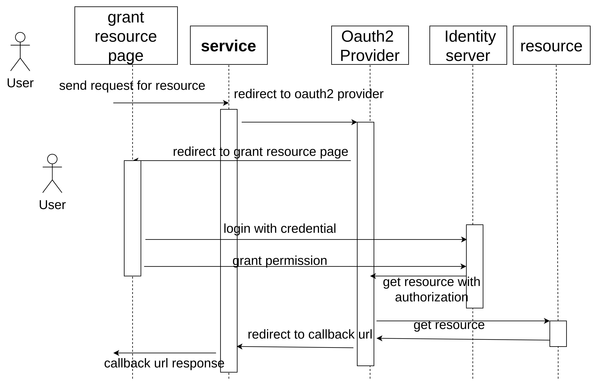

# nest_oauth2_sample

This repository is oauth2 sample with discord as oauth2 provider and nestjs as web server

## Prequest

```shell
pnpm i -S @nestjs/config joi passport @nestjs/passport passport-discord
```

## Steps to setup provider

### 1. go to discord offical websiet

browser open https://discord.com

### 2. find developer docuemnt

### 3. find application

### 4. create new application with a Name

### 5. open oauth2 section generate client id , secret

### 6. setup redirect url for callback with content

http://localhost:3000/api/auth/discord/redirect

## store client_id, secret into application enviroment

### touch .env and create content as follow

```env
DISCORD_CLIENT_ID=
DISCORD_CLIENT_SECRET=
DISCORD_CALLBACK_URL=
```

## oauth2 flow

